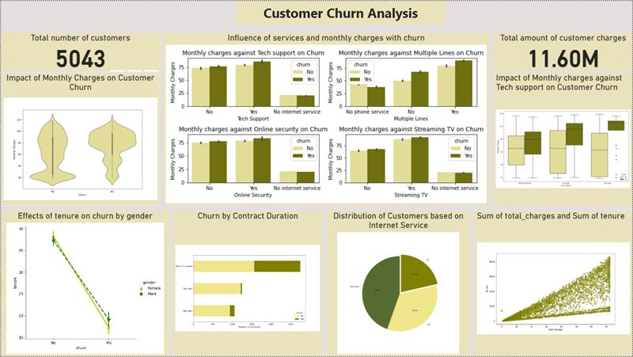

<a name="readme-top"></a>

<div align="center">
  <h1><b>Telco Customer Churn Prediction</b></h1>
</div>

<!-- TABLE OF CONTENTS -->

# 📗 Table of Contents

- [📗 Table of Contents](#-table-of-contents)
- [Project Description ](#Churn-Insight-)
  - [🛠 Built with ](#-built-with-)
    - [Tech Stack ](#tech-stack-)
  - [Key Insights ](#key-features-)
  - [💻 Getting Started ](#-getting-started-)
    - [Prerequisites](#prerequisites)
    - [Setup](#setup)
  - [👥 Authors ](#-authors-)
  - [🤝 Contributing ](#-contributing-)
  - [⭐️ Show your support ](#️-show-your-support-)
  - [🙏 Acknowledgments ](#-acknowledgments-)
  - [📝 License ](#-license-)

<!-- PROJECT DESCRIPTION -->

# Customer Churn Prediction <a name="about-project"></a>

**# Churn Predictor: Forecasting Customer Churn with Machine Learning** The Every company wants to increase its profit or revenue margin and customer retention is one key area industry players focus their resources. In today's world of machine learning, most companies build classification models to perform churn analysis on their customers. 


1. **CustomerID**: Unique Identifier of customer
2. **Gender**: Whether the customer is a male or a female
3. **SeniorCitizen**: Whether a customer is a senior citizen or not
4. **Partner**:Whether the customer has a partner or not (Yes, No)
5. **Dependents**: Whether the customer has dependents or not (Yes, No) 
6. **Tenure**:  Number of months the customer has stayed with the company
7. **Phone Service**:  Whether the customer has a phone service or not (Yes, No)
8. **MultipleLines**:  Whether the customer has multiple lines or not
9. **InternetService**: Customer's internet service provider (DSL, Fiber Optic, No)
10. **OnlineSecurity**:  Whether the customer has online security or not (Yes, No, No Internet)
11. **OnlineBackup**: Whether the customer has online backup or not (Yes, No, No Internet)
12. **DeviceProtection**: Whether the customer has device protection or not (Yes, No, No internet service)
12. **TechSupport**:Whether the customer has tech support or not (Yes, No, No internet)
13. **StreamingTV**: Whether the customer has streaming TV or not (Yes, No, No internet service)
14. **StreamingMovies**:  Whether the customer has streaming movies or not (Yes, No, No Internet service)
15. **Contract**:  The contract term of the customer (Month-to-Month, One year, Two year)
16. **PaperlessBilling**:Whether the customer has paperless billing or not (Yes, No)
17. **MonthlyCharges**:  The amount charged to the customer monthly
18. **PaymentMethod**:The customer's payment method (Electronic check, Mailed check, Bank transfer(automatic), Credit card(automatic))
19. **TotalCharges**: The total amount charged to the customer
20. **Churn**: Whether the customer churned or not (Yes or No).


## 🛠 Built With <a name="Technologies Used"></a>
The Telco Churn Classification Project was done following the CRISP-DM process. It also involved a variety of technologies, programming languages, and libraries to process, analyze, and visualize the data. The following tools were utilized:
4. _Python_: Python programming language was the backbone of the project, used for data processing, analysis, and visualization tasks.
5. _Pandas_ and NumPy: Pandas and NumPy libraries were essential for data manipulation and numerical computations.
6. _Matplotlib and Seaborn_: Matplotlib and Seaborn were employed for data visualization, creating insightful charts and graphs to represent the findings.
7. _Visual Studio Code and Jupyter Notebooks_: Jupyter Notebooks within the Visual Studio IDE provided an interactive environment for running code, visualizing data, and documenting the analysis process.
8. _Scikit-learn_: Scikit-learn's library SimpleImputer was utilized for imputing null values in the amount column.
9. _SQL_: Structured Query Language (SQL) was used for database querying and data retrieval when needed.
10. _GitHub_: GitHub served as the version control system for the project, enabling collaboration and tracking changes in the codebase.
    These technologies played a crucial role in the successful implementation of the project, providing the necessary tools to analyze and derive insights from the Indian Startup Ecosystem funding datasets.

<details>
  <summary>Data Sources</summary>
  <p>For this project, I search through a dataset that is scattered among three different sources and use each to mine for insightful information. The first part, which includes the first 3000 records, is stored in a remote database. I use the pyodc package to retrieve this information from a distance. The second 2000 data is named “Telco-churn-second-2000.xlsx” and is available in OneDrive. This file represents our test dataset, which is a crucial component in assessing the quality of our work. And lastly, “LP2_Telco-churn-last-2000.csv” is the last component, which is stored in the GitHub repository. The first and last datasets were concatenated into for one big dataset, train_df for model training and evaluation.</p>
</details>

<details>
<summary>Database</summary>
  <ul>
    <li><a href="">Microsoft SQL Server</a></li>
  </ul>
</details>

<details>
<summary>Language</summary>
  <ul>
    <li><a href="">Python</a></li>
  </ul>
</details>


<p align="right">(<a href="#readme-top">back to top</a>)</p>
<!-- Features -->

## Success Criteria <a name="key-features"></a>
- Model accuracy: The model's accuracy should be above 70%
- Retention Strategy Effectiveness: The implemented retention strategies should show a measurable impact on reducing customer churn rates. This can be assessed by comparing churn rates before and after implementing the strategies.
- Cost Reduction: The model should contribute to reducing the costs associated with customer acquisition by identifying at-risk customers early on and allowing targeted retention efforts.
- Customer Satisfaction: While focusing on retention, the model and strategies should also aim to maintain or improve customer satisfaction levels. High customer satisfaction leads to increased loyalty and potentially higher customer lifetime value.
- Adaptability and Scalability: The developed model should be adaptable to changing business environments and scalable to accommodate larger datasets or additional features. This ensures its long-term viability and usefulness for the company.
- Feedback and Iteration: Continuous feedback loops should be established to gather insights from the model's predictions and refine the retention strategies accordingly. This iterative process ensures ongoing improvement and optimization of the churn prediction system.

## Key Insights <a name="key-Insights"></a>
The distilled recommendations are as follows:
1. Tailor Pricing Strategies: The analysis reveals a correlation between higher monthly charges and increased customer churn. To bolster retention, Vodafone could explore tailored pricing strategies that balance revenue generation with customer satisfaction and perceived value.

2. Enhance Early Customer Experience: Elevated churn rates during the initial months emphasize the importance of prioritizing early customer experience. By focusing on seamless onboarding processes, service quality, and swift issue resolution, Vodafone can enhance satisfaction and foster loyalty during this critical phase.
3. Promote Long-Term Contracts: Higher churn rates among customers on month-to-month contracts call for attention. Encouraging the adoption of longer-term contracts through incentives and benefits could cultivate commitment and diminish churn.
4. Leverage Additional Services: Services like Online Security and Backup have a notable impact on churn rates. Strengthening these offerings to address customer needs can aid in retention by delivering value-added solutions.
5. Monitor Fiber Optic Offering: Given its high charges and churn rate, meticulous attention to the Fiber Optic service is crucial. Continuously refining and supporting this service will ensure that premium costs align with customer expectations.
6. Personalized Customer Engagement: Utilize insights from churn analysis to craft personalized engagement strategies. Tailored communication, targeted offers, and customized marketing campaigns based on factors such as tenure, contract type, and preferences can enhance loyalty and mitigate churn.

<p align="right">(<a href="#readme-top">back to top</a>)</p>


<!-- GETTING STARTED -->

## 💻 Getting Started <a name="getting-started"></a>


To get a local copy up and running, follow these steps.

### Prerequisites

In order to run this project you need:

- Python


### Setup

Clone this repository to your desired folder:


```sh
  cd my-folder
  git clone https://github.com/adubrightkwartengsnr/LP2-Customer-Churn-Prediction
```

Change into the cloned repository

```sh
  cd Indian_Startup_Ecosystem_Analysis_2018-2021
  
```

Create a virtual environment

```sh

python -m venv env

```

Activate the virtual environment

```sh
    env/Scripts/activate
```


### Install

Here, you need to recursively install the packages in the `requirements.txt` file using the command below 

```sh
   pip install -r requirements.txt
```


<!-- AUTHORS -->

## 👥 Authors <a name="authors"></a>

🕵🏽‍♀️ **Bright Adu Kwarteng Snr**

- GitHub: [GitHub Profile](https://github.com/adubrightkwartengsnr)
- LinkedIn: [LinkedIn Profile](www.linkedin.com/in/bright-adu-kwarteng-snr)

<p align="right">(<a href="#readme-top">back to top</a>)</p>


  
  
<p align="right">(<a href="#readme-top">back to top</a>)</p>

<!-- CONTRIBUTING -->

## 🤝 Contributing <a name="contributing"></a>

Contributions, issues, and feature requests are welcome!

Feel free to check the [issues page](../../issues/).

<p align="right">(<a href="#readme-top">back to top</a>)</p>

<!-- SUPPORT -->

## ⭐️ Show your support <a name="support"></a>

If you like this project kindly show some love, give it a 🌟 **STAR** 🌟

<p align="right">(<a href="#readme-top">back to top</a>)</p>

<!-- ACKNOWLEDGEMENTS -->

## 🙏 Acknowledgments <a name="acknowledgements"></a>

I would like to express my sincere gratitude to my instructors Racheal Appiah-Kubi and Violette Naa Adoley Allotey for their exceptional guidance, unwavering support, and invaluable mentorship throughout the course of this project. Their expertise, dedication, and commitment to our learning journey have been instrumental in shaping our understanding and skills in data analysis.

I would also like to extend a special thank you to Solomon Nyamson for his valuable advice and insights shared during the development of this project. His experiences and expertise in similar projects have been a source of inspiration and guidance, enriching our project with practical knowledge.


<p align="right">(<a href="#readme-top">back to top</a>)</p>

<!-- LICENSE -->

## 📝 License <a name="license"></a>

This project is [MIT](./LICENSE) licensed.

<p align="right">(<a href="#readme-top">back to top</a>)</p>

<p> align="right">(<a href="https://medium.com/@adubrightkwarrteng11/customer-churn-prediction-a-machine-learning-learning-approach-d75d3ef90391">Link to Article</a>)</p>


